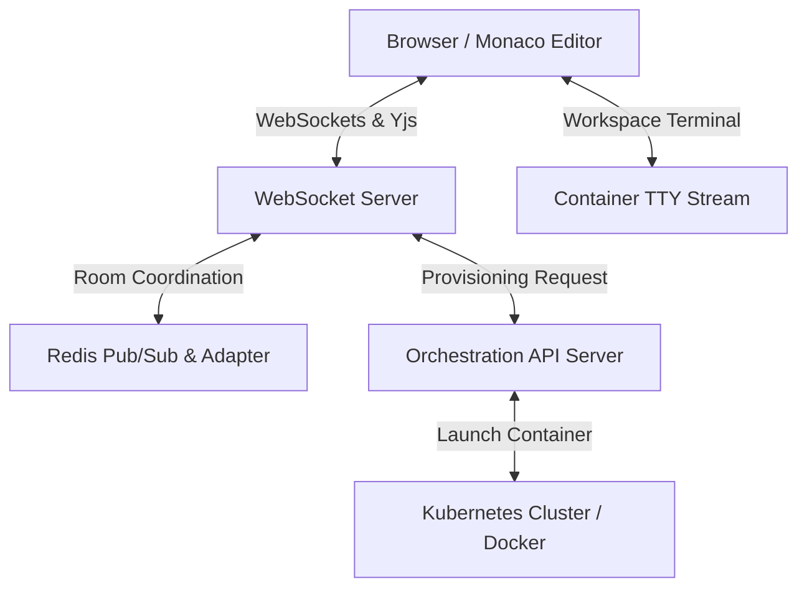

# Collaborative Cloud Code Editor — Architecture & Internals

A secure, cloud-based IDE enabling real-time collaborative coding with isolated container environments, scalable compute provisioning, and live chat.

---

## Architecture Overview

The system is designed to provide users with a desktop-like IDE experience inside their web browser. It consists of three primary layers:

1. **Frontend Editor Layer**: Powered by Microsoft's Monaco Editor (the core of VS Code) and styled with CSS/Tailwind, incorporating a custom terminal, file explorer, and live chat sidebar.
2. **Real-time Synchronization Layer**: Powered by WebSockets and CRDTs to handle concurrent document edits, cursor positions, and chat messages without conflicts.
3. **Container Orchestration Layer**: Powered by Docker and Kubernetes (or localized container runner) to spin up a secure, isolated sandbox sandbox container for every active project session.

---

## Conflict-Free Replicated Data Types (CRDT)

To support seamless collaboration without a central locking mechanism, the system implements a Yjs-based CRDT model.

Unlike Operational Transformation (OT) which requires a centralized server to resolve conflicts, CRDTs resolve conflicts deterministically at the client level:

- **State Vectors**: Every peer maintains a state vector representing the history of operations it has observed.
- **Bi-directional Sync**: When a client connects, it exchanges state vectors with the server. Only the missing deltas are transmitted, minimizing bandwidth.
- **Local Commutes**: Edits are applied locally immediately, giving 0ms latency perception, and then broadcasted. Conflicting edits are resolved automatically based on unique client IDs and sequence numbers.

---

## Containerized Compute Provisioning

Every workspace session runs inside its own isolated Linux container to prevent security risks and resource hogging.

### Isolation Properties

- **Restricted Privileges**: Containers run as non-root users with limited kernel capabilities.
- **Resource Constraints**: Strict limits on CPU (e.g., 0.5 core) and Memory (e.g., 512MB) are enforced using Kubernetes resource quotas or Docker flags.
- **Network Boundaries**: Containers reside in a private virtual network subnet and can only communicate with the orchestration server on specific ports.

### Lifecycle of a Session

1. **Trigger**: User opens a project.
2. **Check**: The orchestration server verifies if a container is already running for the project.
3. **Provision**: If not, it pulls the workspace image containing Node.js, Python, and compiler tools, and launches a container.
4. **Connection**: A WebSocket-to-TCP bridge connects the browser's terminal component directly to the container's shell (`/bin/sh` or `/bin/bash` via `node-pty`).

---

## Network & Real-time Communication

All communication is multiplexed over a secure WebSocket (`wss://`) connection.

- **Edit Channels**: Broadcasts binary delta updates of document changes.
- **Presence Channel**: Broadcasts cursor selections, active line, user colors, and typing states.
- **Terminal Channel**: Streams raw stdin/stdout of the container terminal.
- **Chat Channel**: Delivers real-time messages within the project group.

---

## Scalability on AWS

For production deployments, the system is designed to scale horizontally across AWS infrastructure:

- **Application Load Balancer (ALB)**: Performs path-based routing and handles SSL termination.
- **Amazon EKS**: Manages the life cycle of runner pods, scaling them up or down based on active user sessions.
- **Redis ElastiCache**: Acts as the Pub/Sub adapter to sync room data across multiple independent WebSocket server instances.
- **Amazon S3**: Periodically backs up user workspaces and code snapshots.
